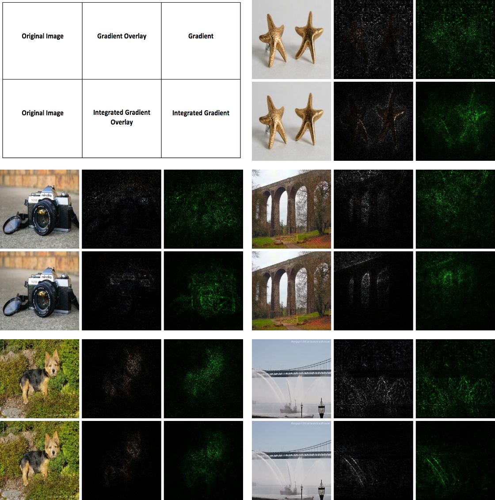
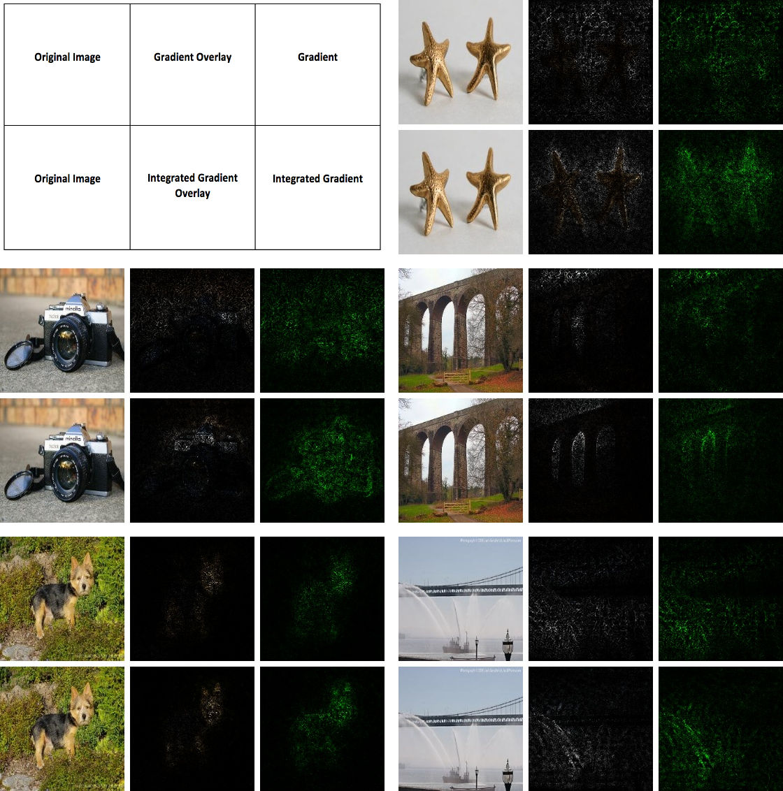
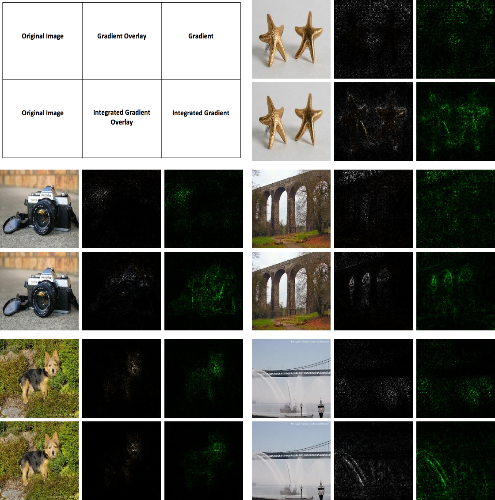
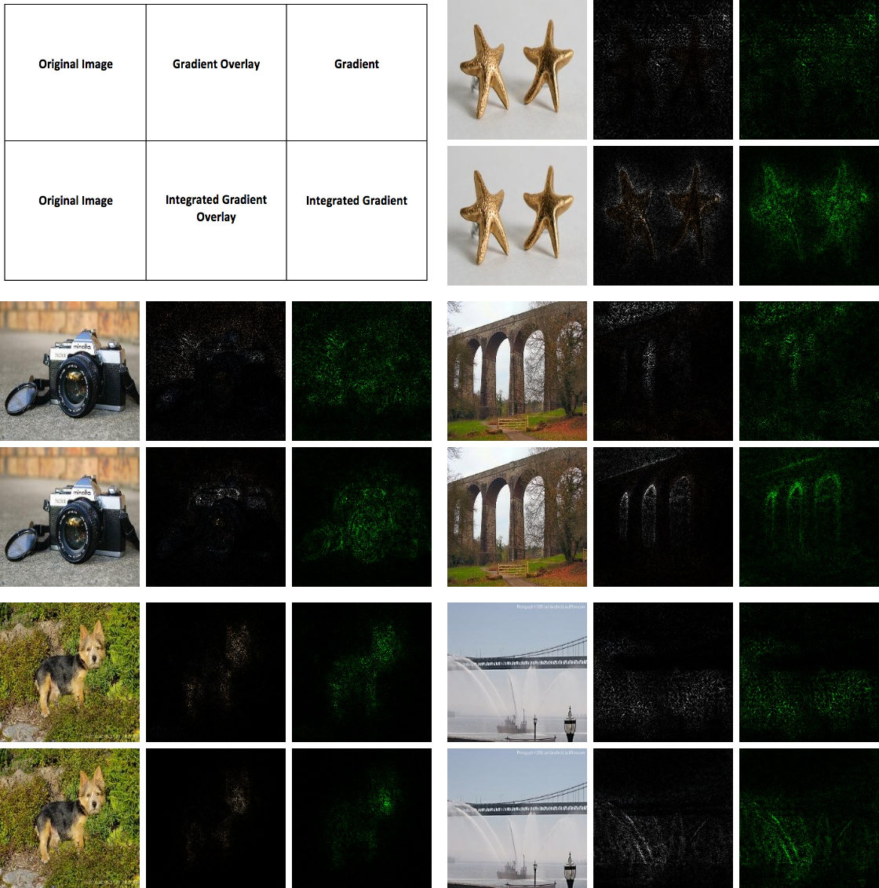

# Integrated Gradients
  
This is the pytorch implementation of ["Axiomatic Attribution for Deep Networks"](https://arxiv.org/pdf/1703.01365.pdf). The original tensorflow version could be found [here](https://github.com/ankurtaly/Integrated-Gradients).
## Acknowledgement
- [ankurtaly's tensorflow version](https://github.com/ankurtaly/Integrated-Gradients)
## Requirements
- python-3.5.2
- pytorch-0.4.1
- opencv-python
## TODO List
- [ ] add more functions as the original code.
- [ ] finetune the results, make them close to the original paper.
## Instructions
**Highly recommend to use GPU to accelerate the computation.** If you use CPU, I will recommend to select some small networks, such as `resnet18`. You also need to put your images under `examples/`.
### Lists of networks that support (of course, you can add any networks by yourself)
- inception
- resnet18
- resnet152
- vgg19
### Run the code
```bash
python main.py --cuda --model-type='inception' --img='01.jpg'

```
## Results
Results are slightly different from the original paper, it may have some bugs or need to do some adjustments. I will keep updating it, any contributions are welcome!
### Inception-v3

### ResNet-18

### ResNet-152

### VGG-19

